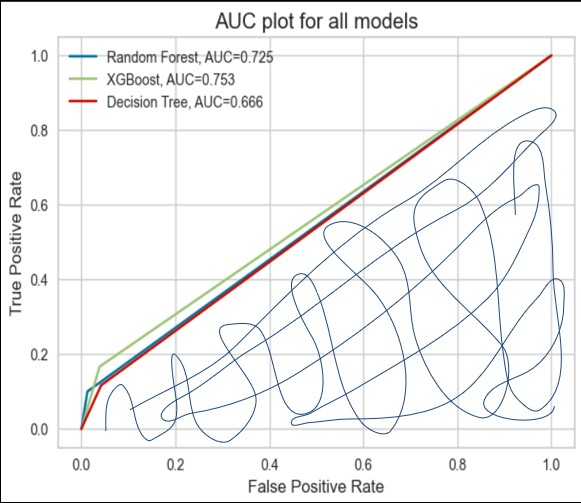
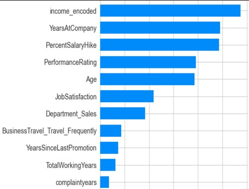

# Employee Attrition Analysis and Prediction
Data Analysis and Machine Learning modelling project on the IBM HR Dataset from kaggle.

- Libraries: pandas, numpy, matplotlib, seaborn, sklearn, metrics, SHAP, PCA, SMOTE etc.
- Tools: python, jupyter.

## EDA
**Analysis - Income with Performance Rating:**

 - Majority  of the employees left because they had low income.
 - Even though some employees had high income, their rating was too low which became a driving factor for their attrition.
 - Employees with medium and high income stayed as compared to low income employees.
 
 

**Analysis - Promotion:**

- 17% of the employees who did not get promotion since last 10 years, left the company.
- Out of the employees who did not receive promotion, many of them left the company because of low income.
 
 

**Analysis - Total working years:**
  
- Attrition rate is more for employees who have worked less than 10 years at the present company as compared to longer serving employees.
- 28% of employees who have worked for  less than 10 years in the same company left because of low income.
 
 

**Analysis - Distance from Home, Working at same company:**
 
- The shorter the distance from home to office, the employee attrition is more, according to the data.
- 20% of the  employees whose total working tenure is <10 years left the company.
- 18% of the employees working at the present company for <10 years, left the company.
- Employees who have worked less or been at the same company for short tenure, tend change the company more.
 
 

**Analysis - High performing employees:**
 
- High performing employees with low income have higher tendency to leave the company as compared to medium/high income ones.
- Employees who got high performance rating and left the company were not satisfied with the job.
- All of the high performing employees, who got less salary hike, from 11-15%, left the company.
- Most employees who got high performance rating and ‘medium’ and ‘high’ salary decided to stay.
 
 

### Analysis Summary
**Reasons for employee attrition:**
- Employees are paid less (low income).
- Their performance rating was too low even though they had decent salary.
- Employees were not given timely promotions or possibly they left because they were not given enough hike even after promotion.
- People aged between 20-40 years who left the company were not satisfied with the job.
- High performing employees left the company because of less salary hike they received even after performing exceptionally.

**How to reduce employee attrition:**
- To retain the high performing employees, we should recognise the employee’s contributions by giving higher ratings and higher rating should yield them higher salary.
- Frequent deserved Promotions can also be a driving factor to decrease the employee attrition.
- Even though promotion is given, employees should be given more hike in salary. This must be paid attention to, as it could lead to increase or decrease in employee attrition rate.
- Focus of employees who have been working less than 10 years, re-evaluate their salary, performance rating, job satisfaction.
- Build good employee relationships through various fun activities, employee support programmes, etc to ensure employees are happy to stay with the company and are satisfied in their job, this will help decrease the attrition.

## Predictive Modelling
**Data Cleaning and Feature Engineering:**
- As with all the Churn Datasets, this dataset is also highly imbalanced with positive churn being the minority class.
- Dropped ‘Over18’ and ‘StandardHours’ columns as they had no variance and hence provided no information
- Handled NaN values in ‘complaintresolved’  with 0 and 1 for two separate models.  ‘complaintyears’, filled them with 0.
- Label encoded ‘MonthlyIncome’ since it was a categorical feature and had an order of values.
- One-hot encoded ‘Gender’, ‘Department’, and ‘BusinessTravel’ because they were categorical but had no order of values.
 

**Model - Evaluation:**

- Various models were tried, with over sampling the minority class and altering class weights because the data is highly imbalanced.
- Dimensionality Reduction Techniques were also used to validate the performance against baseline models but did not yield better results.
- The XGBoost model  without over sampling and without PCA yielded the best results, with a 82% f1-score 
- The recall must be high as we are focused on the employees who left and increasing recall reduces the risk of losing an employee who had even a slight chance of leaving the company.
 
 

**Model - AUC:**

- The area under curve (AUC) plot for the different models without oversampling and without PCA is displayed on the left.
- Maximum AUC is held by the XGBoost model (green line), however it is not distinct from other models so we can say all models are identical.
 
 

### SHAP

 

**Model - Interpretablity:**
- SHAP force plot (above) and Summary Plot (left).
- f(x) is the model prediction. Features pushing the prediction higher than the base value are shown in red, those pushing the prediction lower are in blue
- The mean prediction across the full test dataset serves as the basis value. It is the value that would be projected if the current output had no features.
- Features are ordered in descending order by feature importance. Features with high predicting power are shown at the top and the ones with low predicting powers are shown at the bottom.(left plot)
 
 

### Model - Interpretation
**Key takeaways from model from business perspective:**
- The analysts should focus on features like 'TotalWorkingYears', 'Age', 'MonthlyIncome', 'YearsAtCompany' as these are the ones that push the prediction towards higher side and could to lead to employee attrition. Monitoring these and reducing them will eventually reduce the attrition rate of the company.
- Performance rating, salary hike, job satisfaction, and promotion are among the top features for the prediction model, re-evaluating these could reduce the employee attrition at the company.

